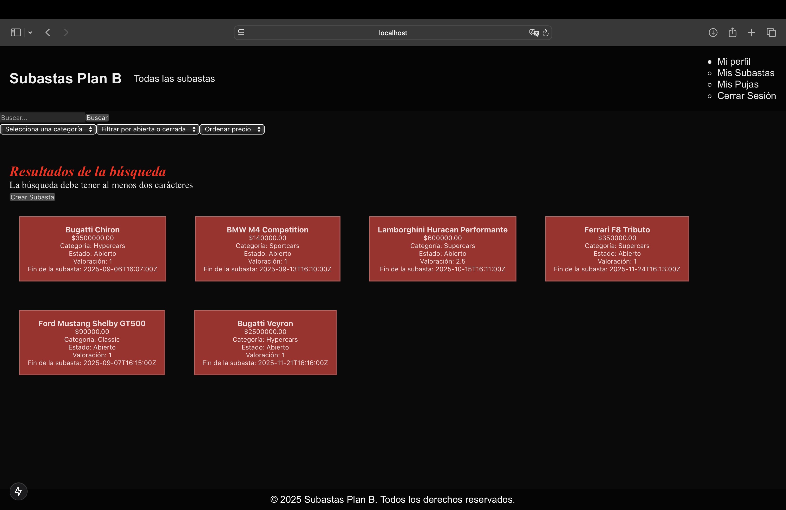
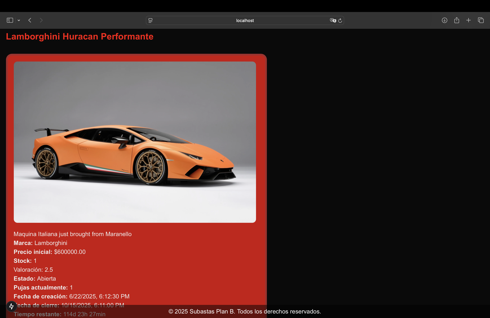

# 🚗 Plan B – Car Auction Platform (Frontend)

This is the **frontend application** for **Plan B**, a modern car auction platform where users can browse vehicle listings, place bids, rate auctions, leave comments, and manage their profiles. The platform is designed with a clean and responsive UI, optimized for usability and performance.

This is the **frontend half of a full-stack application**, built with **React/Next.js**, and powered by a separate backend API built with Django REST Framework that you can find in my other [repository](https://github.com/miguelangelhuamani/CarAuction_Backend.git). It supports dynamic routes, user authentication, form validation, and real-time updates on auctions.

---

## 💡 Key Features

- 🔎 Browse available car auctions with detailed listings
- 📤 Place bids and view bidding history
- 💬 Leave comments and ratings on auctions
- 🧾 Create new auctions with images, categories, prices...
- 🔐 User registration, login, and profile management
- 📱 Fully responsive design using modern components

---

## ⚙️ Tech Stack

- [**Next.js**](https://nextjs.org/) – React framework with App Router & SSR
- [**React**](https://reactjs.org/) – Component-based UI library
- **Axios** – API communication with the backend
- **JWT** – Token-based authentication

---

## 🖼️ Demo Screenshots

### 🏠 Search Page


### 🚗 Auction Detail



## 🚀 Getting Started (Local Execution)

### 1. Clone the repository

```bash
git clone https://github.com/miguelangelhuamani/CarAuction_Frontend.git
cd PlanB
```


### 2. Install dependencies

```bash
npm install
```

### 3. Start the development server

```bash
npm run dev
```
The application will be available at:
```bash
http://localhost:3000
```


## 🌐 Backend API (IMPORTANT)
This frontend is designed to work with the CarAuction_Backend project, which provides the REST API for authentication, auctions, bids, user data...
Ensure the backend is also running locally before interacting with protected routes or placing bids. The instructions for running the backend are provided in the README [here](https://github.com/miguelangelhuamani/CarAuction_Backend.git).